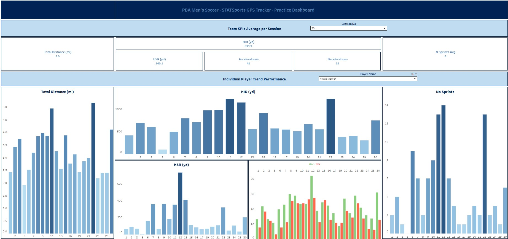

# PBA_Soccer_Performance_Analytics
Data-driven performance analytics for PBA Men’s Soccer — integrating GPS, match, and training data through Power Query and Tableau dashboards.

# End-of-Season Player Dashboard

**Live dashboard:** [View on Tableau Public](https://public.tableau.com/app/profile/guillermo.falo4400/vizzes)

---

## 🧠 Overview
This dashboard summarizes **individual player performance** over an entire season, combining physical and match data to create a professional, easy-to-read player report.

Each player profile includes:
- Personal and roster information (age, jersey, position, height, weight)
- Key performance indicators (minutes, games, goals, assists)
- Match-by-match metrics: distance, intensity, and speed trends

The dashboard allows players to view and share their data interactively, presenting their performance in a professional format suitable for **summer teams or professional trials**.

---

## ⚙️ Data Workflow (Excel Power Query)

**Tools:** Excel Power Query + Tableau Public

1. **Data Extraction**  
   - GPS exports from **StatsSports** (CSV per match)  
   - Roster and match stats from the **PBA Sailfish website** (HTML tables)

2. **Data Cleaning & Transformation**  
   - Load all CSVs and web tables into Excel via Power Query.  
   - Standardize **measures**, **player names**, and **jersey numbers**.  
   - Merge datasets using a consistent **Player ID** key.  
   - Coerce types, rename columns, and ensure consistent units (yards, mph).  

3. **Output**  
   - Clean, analysis-ready dataset exported to Tableau.  
   - Tables: `fact_match_metrics` and `dim_player`.

---

## 📊 KPIs
The following **key performance indicators (KPIs)** summarize season-long contribution:

- **Minutes Played**  
- **Games Played**  
- **Games Started**  
- **Goals**  
- **Assists**

---

## 📈 Metrics (visualized per match)
Deeper physical metrics are tracked through StatsSports GPS data:

- **Minutes per Game**  
- **Distance per Game**  
- **Top 5 Max Speed Peaks**  
- **Top 5 High-Intensity Distance (HID)**  
- **Top 5 High-Speed Running (HSR)**  

These metrics visualize workload trends and peak performance moments throughout the season.

---

## 🎯 Purpose
This dashboard was designed to **serve the players** — giving them a clear, professional “presentation card” that showcases their data, performance, and growth.  

It helps players pursue opportunities with summer teams or professional clubs by giving them **credible data** to back their effort on the field.  

At the same time, it reflects a commitment to **give back to the program** — turning the team’s collective data into a meaningful tool for player development and visibility.

---

## 🧩 Tech Stack
- **Excel (Power Query)** – Data ingestion, transformation, and merging  
- **Tableau Public** – Visualization and dashboard design  
- **GitHub** – Documentation and portfolio hosting  

---

## 🔒 Data Privacy
This repository uses **mock or anonymized data** for demonstration purposes.  
No real GPS or personal player data has been shared publicly.

---

## 💬 About This Project
This repository is part of an ongoing initiative to bring **data-driven analysis** to collegiate soccer.  
The goal is to connect performance, GPS, and match data to deliver tools that help both players and coaches make informed, actionable decisions.

Future additions will include:
- **HUDL Match Analysis Dashboard** – tactical and event-based insights  
- **Player Comparison Dashboard** – GPS benchmarks and position-based trends  

By documenting everything publicly, the intent is to share a **transparent process** that shows how analytics can enhance player development and program growth.

---

## Team vs Player Dashboard (Training Only)

**Live dashboard:** [View on Tableau Public](https://public.tableau.com/app/profile/guillermo.falo4400/vizzes)

### 🧠 Overview
This dashboard focuses **exclusively on training sessions**, not matches.  
It uses **STATSports GPS exports** to analyze each player’s performance during practices.  
The main goal is to let the **PBA coaching staff** compare individual players to team averages for any session, and track each player’s consistency across the season.

### ⚙️ Data Workflow (Excel Power Query)
- Load all STATSports CSVs (one per session) through Power Query.  
- Clean and standardize data (column names, units, player names, jersey numbers).  
- Split `Session Name` into `Session_No` and `Session_Name`.  
- Export the cleaned dataset as a single table to Tableau (`fact_session_metrics`).  
- Team averages are calculated directly in Tableau using table calculations or LOD expressions.

### 📊 Metrics
- **Total Distance (mi)**  
- **High-Intensity Distance (HID, yd)**  
- **High-Speed Running (HSR, yd)**  
- **Accelerations / Decelerations**  
- **Sprints**  
- **Max Speed (mph)**  
- **Impacts**

### 🎯 Purpose (Internal)
This dashboard is **for internal use only** by the PBA Men’s Soccer coaching staff.  
It helps monitor **training load, intensity, and player readiness**, supporting better workload management and recovery planning.  
It’s not linked to official match data or statistics.

### 🧩 Tech Stack
- **Excel (Power Query)** – data ingestion and transformation  
- **Tableau** – dashboard design and visualization  
- **GitHub** – documentation and version tracking

---

---

## 📂 Repository Structure
PBA_Soccer_Performance_Analytics/
│
├── data/
│ └── sample_player_data.csv
│
├── docs/
│ ├── summary_end_of_season.pdf
│ └── screenshots/
│ └── End of the season Dashboard.jpg
│
├── etl/
│ └── power_query_notes.md
│
├── .gitignore
└── README.md

yaml
Copy code

---

*Author: Guillermo Falo*  
*PBA Men’s Soccer Program – Performance & Data Analysis*
